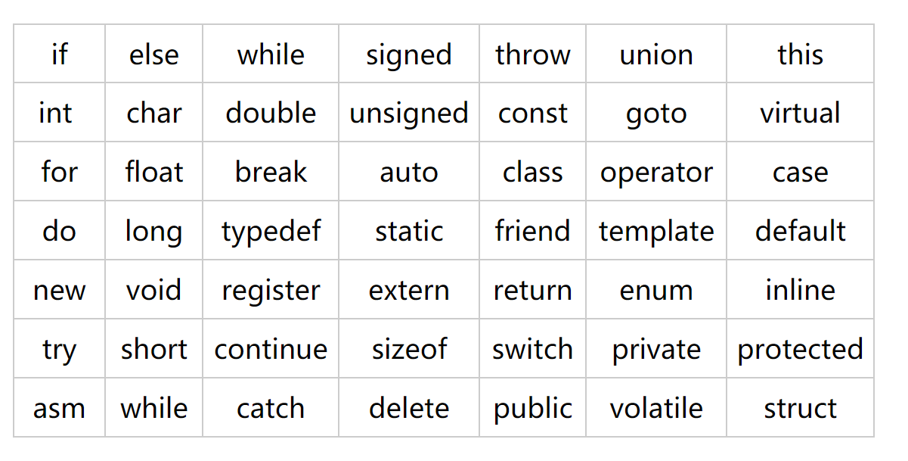

## C++初识
### 第一个C++程序
```cpp
#include <iostream>
using namespace std;
/*
第一个C++程序
main函数是一个程序的入口
main函数的返回值类型是int
main函数的返回值是0
每个程序有且只有一个main函数
*/
int main()
{
    //在屏幕中输出Hello C++
    cout << "Hello C++" << endl;
    system("pause");

    return 0;
}
```
- `#include <iostream>`：引入iostream头文件（输入输出流头文件），可以使用cout,cin,endl等标准库中的函数和对象
-  `using name space std;`：c++标准程序库中所有标识符都被定义与一个名为std的namespace中， `using name space std;`用于告诉编译器在当前程序中使用标准命名空间“std"中的所有标识符。这样程序中就可以直接使用cout,cin,endl等标准库中的函数和对象，而不必使用完整的限定名来表示。如果不用此句,就得使用`std::cout `,如下。
```cpp
#include <iostream>

int main()
{
    //在屏幕中输出Hello C++
    std::cout << "Hello C++" << std::endl;
    system("pause");

    return 0;
}
```
- `//`为单行注释，`/*...*/`为多行注释
- `int main(){}`代表了C++语言的入口函数，其中int是函数的返回值类型，main是函数名，这个是固定的不能改，一个C++语言程序想要运行，就是从这个函数开始的；
- `cout << "Hello C++" << endl;`本质上是将字符串"Hello C++"插入到`cout`对象里，并以`cout`对象作为返回值返回，`endl`直接插入到`cout`对象里，起到输出换行的作用。
```cpp
#include <iostream>
using namespace std;
int main()
{
    cout << "Hello " << endl <<"林时小卡  " << endl << "这是你第一个C++程序";
    return 0;
}
```
输出结果
```
Hello

林时小卡

这是你第一个C++程序
```
- `system("pause");`是程序暂停而不退出，按任意键退出。
- `return 0；`代表返回一个整数，任何函数都要有返回值。
# 变量
## 作用
- 给一段指定的内存空间取名，方便操作这段内存。
## 语法
- `数据类型 变量名 = 初始值`:`int a = 10;`
- 声明多个变量：`int a,b,c;`
- 声明并初始化多个变量：`int a = 1,b = 2,c = 9;
## 示例
```cpp
#include <iostream>
using namespace std;

int main() {

    //创建变量：数据类型 变量名 = 变量初始值
    int a = 10;

    cout << "a = " << a << endl;

    system("pause");

    return 0;
}
```
输出
```
a = 10
```
# 常量
## 作用
- 用于记录程序中不可更改的数据
## 定义方法
- `#define`宏常量：`define 常量名 常量值`,通常在文件上方定义，表示一个常量。
- `const`修饰的变量：`const 数据类型 常量名 = 常量值`,通常在变量定义前加关键字`const`,修饰该变量为常量，不可修改。
## 示例
```cpp
#include<iostream>
using namespace std;

//#define 常量名 常量值
#define DaysInWeek 7
int main(){

    cout << DaysInWeek << " days in a week." << endl;

    //const 数据类型 常量名 = 常量值
    const int months = 12;
    
    cout << months << " months in a year." << endl;

    system("pause");

    return 0;
}
```
# 标识符
## 标识符命名规则
1. 由26个英文字母大小写，0-9，_,组成
2. 数字不可以开头
3. 大小写敏感，长度无限制，但不能太长，那也太长了
4. 不可以使用关键字
5. 不能使用双下划线开头，也不能以下划线加大写字母开头，这些被c++保留给标准库使用
6. 函数体外的标识符，不能以下划线开头
7. 尽量有实际意义
8. 变量名一般用小写字母
9. 自定义类名一般以大写字母开头
10. 如果包含多个字母，一般使用下划线分割，或者后面单词手字母大写
## c++中的关键字

# 数据类型
- c++规定在创建一个变量或者常量时，必须指定数据类型，否则无法给变量分配内存。
- 数据类型存在的意义是给变量分配合适的内存空间。

## sizeof关键字
### 作用
- 利用sizeof关键字可以统计数据类型所占内存大小
### 语法
- `sizeof(数据类型/变量)`
### 示例
```cpp
#include<iostream>
using namespace std;

int main(){

    //sizeof(数据类型/变量)
    int num1 = 7;
    
    cout << "num1占用内存空间为：  " << sizeof(num1) << endl;

    system("pause");

    return 0;
}
```
## 整型
- 整型变量表示的是整数类型的数据

| 数据类型 | 类型含义 | 占用空间 | 取值范围 |
| ---- | ---- | ---- | ---- |
| short | 短整型 | 2字节 | $[-2^{15}, 2^{15}-1]$ |
| int | 整型 | 4字节 | $[-2^{31}, 2^{31}-1]$ |
| long | 长整型 | win4字节 | $[-2^{31}, 2^{31}-1]$ |
| long long | 长长整型 | 8字节 | $[-2^{63}, 2^{63}-1]$ |
## 实型
- 用于表示小数

| 数据类型 | 数据类型 | 占用空间 | 取值范围 |  |
| ---- | ---- | ---- | ---- | ---- |
| float | 单精度浮点型 | 4字节 | 7位有效数字 |  |
| double | 双精度浮点型 | 8字节 | 15-16位有效数字 |  |
> [!WARNING] WARNING
>  小数点前和小数点后都是有效数字，默认情况下，输出一个小数，会显示出6位有效数字。
### 示例
```cpp
#include<iostream>
using namespace std;

int main(){

    //c++中小数默认为double类型，float类型小数用f结尾。
    //如果不加f,下行代码含义为：将3.14这个double类型小数转化为float类型小数，再赋值给num1变量。
    float num1 = 3.1415926f;
    cout << "num1为:  " << num1 << endl;

    double num2 = 3.1415926;
    cout << "num2为:  " << num2 << endl;
	//科学计数法
	float f1 = 3e2;//3e2 = 3*10^2 = 300
	float f2 = 3e-2;//3e-2 = 3*10^-2 = 3*0.1^2 = 0.03
	cout << "f1 = " << f1 << endl;
    cout << "f2 = " << f2 << endl;
    return 0;
}
```
## 字符型
### 作用
- 字符型变量显示于字符
### 语法
- `char ch = 'a'`
> [!WARNING] WARNING
> 1. 在显示字符变量时，用单引号而不是双引号。
> 2. 单引号内只能有一个字符不能是字符串。
- C和C++中字符型变量只占用一个字节。
- 字符型变量并不是吧字符本身放在内存中储存，而是将对应的ASCII编码放入到储存单元。
### 示例
```cpp
#include<iostream>
using namespace std;

int main(){

    //字符型变量用 单引号 单字母
    char ch = 'T';
    cout << ch << endl;
    cout << (int)ch << endl; //输出字符型变量的十进制ASCII码
    
    return 0;
}
```
## 转义字符
### 作用
- 用于表示一些不能显示出来的ASCII字符
### 举例
- `\n`换行，newline
- `\t`水平制表(缩进)，Tab
- `\\`代表一个反斜线字符`\`
- `\'`代表一个单引号，`\"`代表一个双引号
### 示例
```cpp
#include<iostream>
using namespace std;

int main(){
    cout << "Hello\nC++\n"; // \n换行
    cout << "Hello\tC++\n"; // \t缩进,包括前面的字符，一共输出占8个字符
    cout << "Hello\\C++"; // \\代表\
    
    return 0;
}
```
## 字符串型
### 作用
- 用于表示以串字符
### 语法
- C语言风格：`char 变量名[] = "字符串值"`
- C++语言风格：`string 变量名 = "字符串值"
> [!WARNING] WARNING
> - C语言风格字符串变量名后要加`[]`，字符串值要用双引号
> - C++语言风格字符串，需要引入一个头文件`#include <string>`
### 示例
```cpp
#include<iostream>
#include<string>
using namespace std;

int main(){
    //C语言风格字符串
    char str[] = "hello";
    cout << str << endl;
    //C++语言风格字符串
    string str2 = "world";
    cout << str2 << endl;
    
    return 0;
}
```

## 布尔类型
### 作用
- 代表真或者假
- 只有两个值：true，false
- 布尔类型占用一个字节大小
### 语法
- `bool 变量名 = 变量值;`
### 示例
```cpp
#include<iostream>
using namespace std;

int main(){
    bool flag = true;
    cout << flag << endl;

    flag = false;
    cout << flag << endl; 
    
    return 0;
}
```
## 数据的输入
### 作用
- 用于从键盘获取数据,相当于Python中的`input`
- 关键字为`cin`
### 语法
- `cin >> 变量`
### 示例
```cpp
#include<iostream>
using namespace std;

int main(){
    //int
    int a = 0;
    cout <<"请给整型变量a赋值:"<<endl;
    cin >> a;
    cout <<"整型变量a的值是:"<< a << endl;

    //
    return 0;
}
```
### **插入运算符**和**提取运算符**
- **插入运算符**（**<<**）用于将数据从程序插入到输出流中。输出流可以是标准输出流（**cout**），也可以是文件、内存等其他流。

- **提取运算符**（**>>**）用于将数据从输入流中提取到程序中。输入流可以是标准输入流（**cin**），也可以是文件、内存等其他流。

- **cout << "Hello " << endl;**

	- **cout**是标准输出流，**"Hello "**是一个字符串，**endl**是一个换行符。**<<**运算符将**"Hello "**和**endl**插入到**cout**中，输出到标准输出设备（通常是屏幕）。

- **cin >> a;**

	- **cin**是标准输入流，**a**是一个变量。**>>**运算符将**cin**中的数据提取到**a**中。

- **总结**

	- **<<**和**>>**符号是C++编程语言中的重要运算符，用于在程序与输入输出流之间进行数据传输。

	- **<<**符号是**插入运算符**，用于将数据从程序插入到输出流中。

	- **>>**符号是**提取运算符**，用于将数据从输入流中提取到程序中。
# 运算符
- 用于执行代码的运算
- 主要有如下积累
	- 算数运算符：用于处理四则运算
	- 赋值运算符：用于将表达式的值赋给变量
	- 比较运算符：用于表达式的比较，返回布尔值
	- 逻辑运算符：根据表达式的值返回布尔值
## 算数运算符
- 作用：用于处理四则运算

| 运算符 | 术语 | 示例 | 结果 |
| ---- | ---- | ---- | ---- |
| + | 正号，加法 | 10+5 | 15 |
| - | 负号，减法 | 10-5 | 5 |
| * | 乘法 | 10*5 | 50 |
| / | 除法 | 10/5 | 2 |
| % | 取模，取余 | 10%3 | 1 |
| ++ | 前置递增 | a=2;b=++a; | a=3;b=3; |
| ++ | 后置递增 | a=2;b=a++; | a=3;b=2; |
| -- | 前置递减 | a=2;b=--a; | a=1;b=1; |
| -- | 后置递减 | a=2;b=a--; | a=1;b=2; |
### **自增**运算符
  
- 在C++编程语言中，**a=2;b=++a;**和**a=2;b=a++;**这两种情况的区别在于**运算符++的位置不同**。

- **++a**是**前置自增**运算符，它会在表达式求值之前先将变量自增1。而**a++**是**后置自增**运算符，它会在表达式求值之后再将变量自增1。

- 因此，在**a=2;b=++a;**中，**++a**会在**b=a**之前执行，所以**b**的值为**3**。而在**a=2;b=a++;**中，**a++**会在**b=a**之后执行，所以**b**的值为**2**。

- 以下是两种情况的执行过程：

	- **a=2;b=++a;**

		1. **a=2**执行，将**2**赋给**a**。
		2. **++a**执行，将**a**的值自增1，变为**3**。
		3. **b=a**执行，将**a**的值赋给**b**，**b**的值变为**3**。

	- **a=2;b=a++;**

		1. **a=2**执行，将**2**赋给**a**。
		2. **b=a**执行，将**a**的值赋给**b**，**b**的值变为**2**。
		3. **a++**执行，将**a**的值自增1，变为**3**。

- **总结**

	- **a=2;b=++a;**和**a=2;b=a++;**的区别在于**运算符++的位置不同**。**++a**是**前置自增**运算符，**a++**是**后置自增**运算符。前置自增会在表达式求值之前先将变量自增1，而后置自增会在表达式求值之后再将变量自增1。

	- 在实际应用中，我们可以根据需要选择使用前置自增或后置自增运算符。例如，如果我们需要在表达式中使用变量的最新值，则可以使用前置自增运算符。如果我们只需要使用变量的旧值，则可以使用后置自增运算符。

> [!WARNING] WARNING
> - 整型除以整型结果还是一个去除小数的整型
> - 两个小数不可以做取模运算
> - 前置递增，先自增再输出。后置递增，先输出再自增
### 递增递减示例
```cpp
#include<iostream>
using namespace std;

int main(){
    //前置递增
    int a = 10;
    ++a;
    cout << "a = " << a << endl;

    //后置递增
    int b = 10;
    b++;
    cout << "b = " << b << endl;

    //前置和后置的区别
    //前置递增，先自增再输出
    int a2 = 10;
    int b2 = ++a2 * 10;//先自增a2=11,b2=11*10=110
    cout << "a2 = " << a2 << endl;
    cout << "b2 = " << b2 << endl;
    //后置递增，先输出再自增
    int a3 = 10;
    int b3 = a3++ * 10;//先输出a3=10,b3=10*10=100,再自增a3=11
    cout << "a3 = " << a3 << endl;
    cout << "b3 = " << b3 << endl;

    return 0;
}
```
## 赋值运算符
### 作用
- 用于将表达式的值赋给变量

| 运算符 | 术语 | 示例 | 结果 |
| ---- | ---- | ---- | ---- |
| = | 赋值 | a=3 | a=3 |
| += | 加等于 | a=1;a+=2； | a=3 |
| -= | 减等于 | a=5;a-=3; | a= 2 |
| *= | 乘等于 | a=2;a*=3; | a=6 |
| /= | 除等于 | a=4;a/=2; | a=2 |
| %= | 模等于 | a=3;a%=2; | a=1 |
## 比较运算符
- 用于表达式的比较，返回布尔值

| 运算符 | 术语 | 示例 | 结果 |
| ---- | ---- | ---- | ---- |
| == | 相等于 | 4==3 | 0 |
| != | 不等于 | 4!=3 | 1 |
| < | 小于 | 4<3 | 0 |
| > | 大于 | 4>3 | 1 |
| <= | 小于等于 | 4<=3 | 0 |
| >= | 大于等于 | 4>=3 | 1 |
## 逻辑运算符
- 用于根据表达式的值返回布尔值

| 运算符 | 术语 | 示例 | 结果 |
| ---- | ---- | ---- | ---- |
| ! | 非 | !a | a取反 |
| && | 与 | a&&b | a,b都为真则结果为真。 |
| \|\| | 或 | a\|\|b | a,b有一个为真则结果为真。 |
 