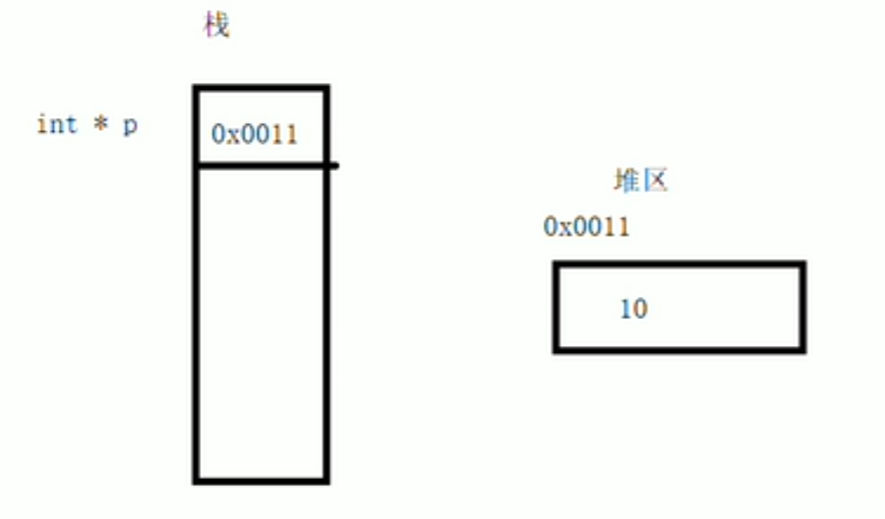

# 内存分区模型
C++程序在执行时，将内存大方向划分为四个区域：
- 代码区：存放函数体的二进制代码，由操作系统进行管理。
- 全局区：存放全局变量，静态变量以及全局常量，程序结束时由操作系统回收。
- 栈区：由编译器自动分配释放，存放函数的参数值，局部变量等。
- 堆区：由程序员分配和释放，若程序员不释放，程序结束时由操作系统回收。

> [!NOTE] 意义
> 内存四区的意义：
> 不同区域存放的数据，赋予不同的生命周期，给编程更大的灵活性

# 程序运行前
在程序编译后，生成了exe可执行程序，**未执行该程序前**分为两个区域：
## 代码区：
- 存放CPU执行的机器指令。
- 代码区是**共享**的，共享的目的是对于频繁被执行的程序，只需要在内存中有一份代码即可。
- 代码区是**只读**的，使其只读的原因是防止程序以外的修改了它的指令。
## 全局区：
- 全局变量和静态变量存放在此。
- 全局区还包含了常量区，字符串常量和其他常量也存放在此。
- 该区域的数据在程序结束后有操作系统释放。
```cpp
#include <iostream>
using namespace std;
//全局区，存放全局变量、静态变量和常量

int global_var = 10; // 全局变量（全局区）
const int global_con = 10; // 全局常量（全局区）

int main() 
{
	int local_var = 10; // 局部变量
	static int sta_var = 10; // 静态变量（全局区）
	const int local_con = 10; // 局部常量

	cout << "局部变量local_var的地址为："  << &local_var     << endl;

	cout << "全局变量global_var的地址为：" << &global_var    << endl;
	cout << "静态变量global_var的地址为：" << &sta_var       << endl;

	cout << "字符串常量的地址为："         << &"Hello World" << endl;
	cout << "全局常量global_con的地址为：" << &global_con    << endl;
	cout << "局部常量local_con的地址为："  << &local_con     << endl;
}
```
> [!NOTE] 总结
> - C++在程序运行前分为全局区和代码区
> - 代码区的特点是共享和只读
> - 全局区中存放全局变量，静态变量，全局常量，和字符串常量。
# 程序运行后
## 栈区：
- 由编译器自动分配释放，存放函数的参数值，局部变量等。
- 注意：不要返回局部变量的地址，栈区开辟的数据有编译器自动释放。
```cpp
#include <iostream>
using namespace std;

//栈区数据由编译器管理，不要返回局部变量地址
int* func(int b) //形参数据也会放在栈区
{
	b = 100;
	int a = 10; // 局部变量存放在栈区，栈区在函数执行完毕后自动释放。
	return &a; //返回局部变量地址
}
int main() 
{
	// 请用x86编译
	int* p = func(1);
	cout << *p << endl; // 10, 第一次可以打印正确数字，是因为编译器做了保留
	cout << *p << endl; // 1892321392，第二次这个数据不再保留
}
```
## 堆区
- 由程序员分配释放，若程序员不释放，由操作系统回收。
- 在C++中主要利用new在堆区开辟内存
```cpp
#include <iostream>
using namespace std;

int* func()
{
	//利用new关键字，可以将数据开辟到堆区
	//指针变量p本质上也是局部变量，放在栈区。指针保存的数据是放在堆区。
	int* p = new int(10);
	//返回内存地址
	return p;
}
int main() 
{
	//在堆区开辟数据
	int* p = func();
	cout << p << endl;
}
```


# new操作符
- C++中利用new操作符在堆区开辟数据
- 堆区开辟的数据，由程序员手动开辟，手动释放，释放利用操作符delete
- 语法：`new 数据类型`
- 利用new创建的数据，会返回该数据对应类型的指针
```cpp
#include <iostream>
using namespace std;

int* func()
{
	//利用new关键字，可以将数据开辟到堆区
	//指针变量p本质上也是局部变量，放在栈区。指针保存的数据是放在堆区。
	int* p = new int(10);
	//返回内存地址
	return p;
}

void test01()
{
	int* q = func();
	cout << *q << endl;
	//delete关键字释放堆区数据
	delete q;
	//cout << *q << endl;//引发异常

}
void test02()
{
	//在堆区创建数组,创建后返回数组内存首地址，用指针变量接受
	int* arr = new int[10];
	//给数组赋值
	for (int i = 0; i < 10; i++)
	{
		arr[i] = 100 + i;
	}
	// 输出数组
	for (int i = 0; i < 10; i++)
	{
		cout << arr[i] << endl;
	}
	//释放堆区数组，要加"[]"
	delete[] arr;
}
int main() 
{
	test02();
}
```