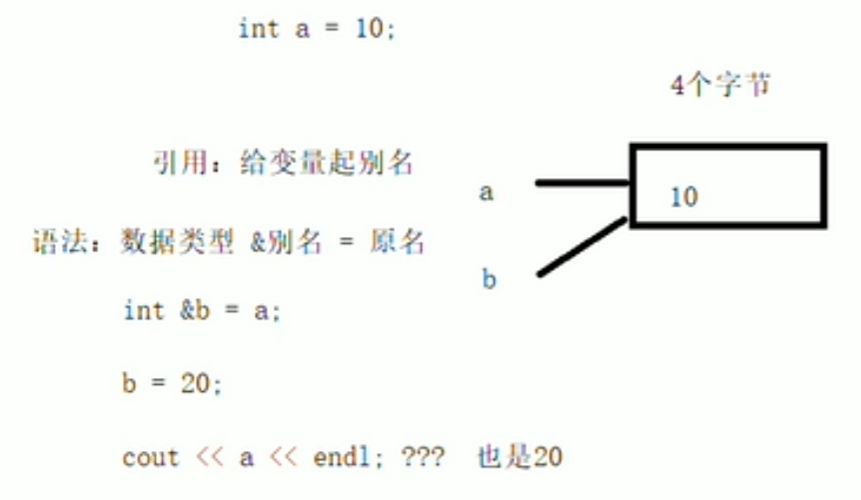
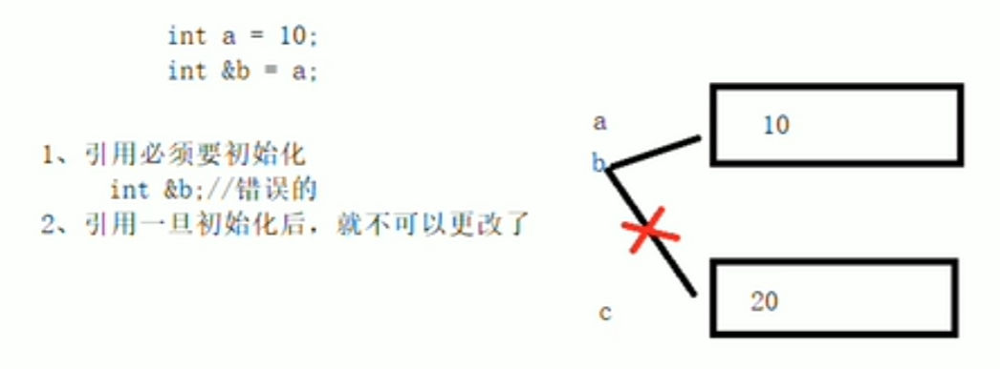

# 引用的基本使用
- 作用：给变量取别名
- 语法：`数据类型 &别名 = 原名`
- 图示：

- 示例：
```cpp
#include <iostream>
using namespace std;

int main() 
{
	//引用的基本语法：数据类型 &别名 = 原名
	int a = 10;
	int& b = a;
	cout << "a = " << a << endl;
	cout << "b = " << b << endl;

	b = 100;
	cout << "a = " << a << endl;
	cout << "b = " << b << endl;

	system("pause");

	return 0;
}
```
# 引用的注意事项
- 引用必须初始化，不可以先声明再赋值。
- 引用在初始化后，不可改变
- 图示

```cpp
#include <iostream>
using namespace std;

int main() 
{
	//引用的基本语法：数据类型 &别名 = 原名
	int a = 10;
	//1.引用必须初始化赋值
	//int& b; //错误

	int& b = a;
	//2.引用在初始化后，不可改变。
	int c = 20;
	b = c; // 赋值操作，而不是更改引用。

	cout << "a = " << a << endl; // a = 20
	cout << "b = " << b << endl; // b = 20
	cout << "c = " << c << endl; // c = 20

	system("pause");

	return 0;
}
```
# 引用做函数参数
- 作用：函数传参时，可以利用引用技术让形参修饰实参
- 优点：可以简化指针修改实参
- 示例:
```cpp
#include <iostream>
using namespace std;

// 交换函数

// 1.值传递
void mySwap01(int a, int b)
{
	int temp = a;
	a = b;
	b = temp;
}

// 2.地址传递
void mySwap02(int* a, int* b)
{
	int temp = *a;
	*a = *b;
	*b = temp;
}
// 3.引用传递
void mySwap03(int &a, int &b)
{
	int temp = a;
	a = b;
	b = temp;
}
int main() 
{
	int c = 10;
	int d = 20;

	//mySwap01(c, d); // 值传递，形参不会修改实参
	//mySwap02(&c, &d); // 地址传递，形参可以修改实参
	mySwap03(c, d); // 引用传递，形参可以修改实参

	cout << "c = " << c << endl;
	cout << "d = " << d << endl;


	system("pause");

	return 0;
}
```
# 引用做函数返回值
- 作用：引用是可以作为函数返回值存在的
- 注意：不要返回局部变量引用 
- 用法：函数调用作为左值
- 示例：
```cpp
#include <iostream>
using namespace std;
//1.不要返回局部变量的引用 
int& test1()
{
	int a = 10;//局部变量存放在栈区，栈区在函数执行完后会被释放
	return a;
}
//2.函数的调用可以作为左值
int& test2()
{
	static int a = 10;//静态变量存放在全局区，全局区在程序执行结束后被释放
	return a;
}
int main() 
{
	int& ref = test1();
	cout << "ref = " << ref << endl; //ref = 10,第一次结果正确，是因为编译器做了数据保留
	cout << "ref = " << ref << endl;//ref = 2076739696，第二次结果错误，因为a的内存空间已释放

	int& ref2 = test2();
	cout << "ref2 = " << ref2 << endl; //ref2 = 10
	cout << "ref2 = " << ref2 << endl;//ref2 = 10

	//如果函数的返回值是引用，这个函数调用可以作为左值
	test2() = 1000;//返回a的引用并赋值1000，此时a的内存地址中储存的值为1000
	cout << "ref2 = " << ref2 << endl; //ref2 = 1000
	cout << "ref2 = " << ref2 << endl;//ref2 = 1000

	system("pause");
	return 0;
}
```
# 引用的本质
- 引用的本质在C++内部实现是一个指针常量，所以一旦初始化后不可更改。
- 示例：
```cpp
#include <iostream>
using namespace std;
//发现是引用，转换为 int * const ref = $a;
void func(int& ref)
{
	ref = 100;//ref是引用，转换为 *ref = 100;
}
int main() 
{
	int a = 10;

	//自动转换为 int* const ref = &a;指针常量是指针指向不可更改，也说明为什么引用不可更改
	int& ref = a;
	ref = 20;//内部发现ref是引用，自动帮我们转换为 *ref = 20;

	cout << "a:" << a << endl;
	cout << "ref:" << ref << endl;

	func(a);
	return 0;
}
```
# 常量引用
- 作用：常量引用主要来修饰形参，防止误操作导致形参改变实参。
- 示例：
```cpp
#include <iostream>
using namespace std;
//打印数据函数
void showValue(const int& val)
{
	//val = 1000;//常量引用修饰形参，无法修改形参
	cout << "val = " << val << endl;
}
int main() 
{
	//常量引用，用来修饰形参，防止误操作
	int a = 10;
	showValue(a);
	//int& ref = 10;//错误，非常量引用的初始值必须为左值，

	//加上const之后，编译器将代码修改 int temp = 10; const int& ref = temp;
	const int& ref = 10;

	//ref = 20;//错误，加入const之后变为只读，不可修改。

	return 0;
}
```