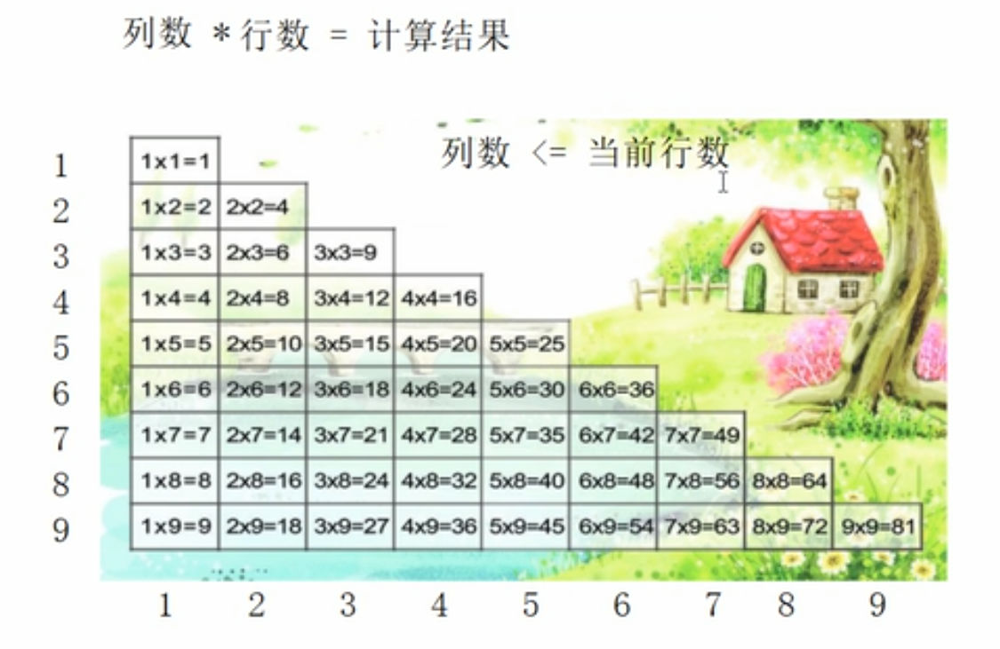

# 循环结构
## While循环结构
### 普通While循环
- 作用：满足循环条件，执行循环语句
- 语法：`while(循环条件){循环语句}
- 解释：只要循换条件为真，就执行循环条件
```cpp
#include<iostream>
using namespace std;

int main(){

    //While循环
    int num = 0;
    while(num < 10){
        cout << num << endl;
        num++;
    }

    return 0;
}
```
 - 示例
	- 猜数字：系统随机生成一个1-100之间的数字，玩家进行猜测，如果猜错，提示玩家数字过大还是过小，如果才对恭喜退出
```cpp
#include <iostream>
#include <ctime> //引入系统事件头文件
using namespace std;

int main(){
    //猜数字

    /*添加随机数种子，利用当前系统事件生成随机数，防止每次随机数都一样
    1.srand()函数只接受一个参数，该参数是一个整数值，用作随机数生成器的种子。
    2.通过将当前系统时间的秒数time(NULL)转换为无符号整数(unsigned int)传递给srand(),
    (unsigned int)是一个类型转换操作符。*/
    srand((unsigned int)time(NULL));
    int num = rand()%100 + 1; // rand()%100生成0-99之间的随机数，+1后为1-100之间的随机数
    //cout << num << endl;

    int val = 0;
    while(1){
        cout << "请输入猜测数字" << endl;
        cin >> val;
        if(val > num){
            cout << "猜测过大" << endl;
        }else if(val < num){
            cout << "猜测过小" << endl;
        }else{
            cout << "恭喜您猜对了" << endl;
            break;
        }
    }
}
```
### do...while循环语句
- 作用：满足循环条件，执行循环语句
- 语法：`do{循环语句} While(循环条件)；`
- 注意：与While循环的区别在于，do...while会先执行一次循环语句，在判断循环条件
- 示例1：do...while语句，输出0-9十个数字
```cpp
#include <iostream>
using namespace std;

int main(){
    //do...while语句，输出0-9十个数字
    int num = 0;
    do{
        cout << num << endl;
        num++;
    }while(num < 10);

    return 0;
}

```
- 示例2：水仙花数，是指一个三位数，它每位上的数字的三次幂之和等于它本身。
$$
153 = 1^3 + 5^3 + 3^3
$$
[Open: Pasted image 20231231103741.png](attachments/720f911ac3190f44047e49b79fdd04eb_MD5.jpeg)

```cpp
#include <iostream>
using namespace std;

int main(){
    //水仙花数
    int num = 100;
    do{
        int a = num % 10; //获取个位数字
        int b = num / 10 % 10; //或取十位数字
        int c = num / 100;//获取百位数字

        if(a*a*a+b*b*b+c*c*c== num){
            cout << num << endl;
        }
        num++;
    }while(num < 1000);

    return 0;
}
```
## for循环语句
- 作用：满足循环条件，执行循环语句
- 语法：`for(起始表达式;条件表达式;末尾循环体){循环语句;}`
- 示例
```cpp
#include <iostream>
using namespace std;

int main(){
    //for循环
    for(int i = 0; i < 100; i++){
        cout << i << endl;
    }

    return 0;
}

```
- 案例：敲桌子，从1开始数到100，如果数字含7或者是7的倍数，打印敲桌子，否则打印数字。
```cpp
#include <iostream>
using namespace std;

int main(){
    //敲桌子
    for(int i = 1;i <= 100;i++){
        if((i % 10 == 7) || (i / 10 == 7) || (i % 7 == 0)){
            cout << "敲桌子" << endl;
        }else{
            cout << i << endl;
        }
    }

    return 0;
}
```
## 嵌套循环
- 作用：在循环体中再嵌套一层循环，解决一些实际问题
- 案例：打印如下
- [Open: Pasted image 20231231112103.png](attachments/d33787de6aef7afd3c9ed5b4109f50d9_MD5.jpeg)

```cpp
#include <iostream>
using namespace std;

int main(){
    //嵌套循环
    for(int i = 0;i < 10;i++){
        for(int j = 0;j < 10;j++){
            cout << "* ";
        }
        cout << endl;
    }
    return 0;
}

```
- 案例：乘法口诀
- [Open: Pasted image 20231231113409.png](attachments/b893dbce60584156a81be68674fd35c5_MD5.jpeg)

```cpp
#include <iostream>
using namespace std;

int main(){
    //乘法口诀
    for(int i = 1;i <= 9;i++){// 行数
        //cout << i << endl;
        for(int j = 1;j <= i;j++){ //列数，列数小于等于当前行数
            cout << j << "*" << i << "=" << j*i << "   ";
        }
        cout << endl;
    }
    return 0;
}
```