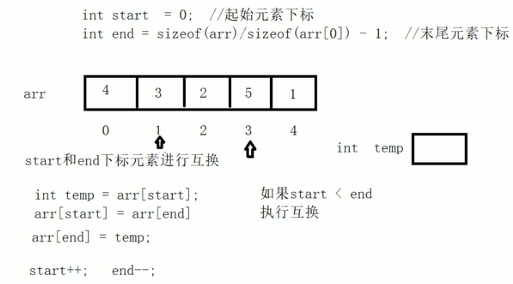
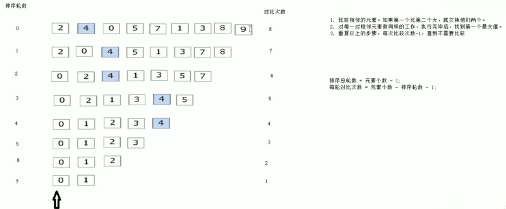
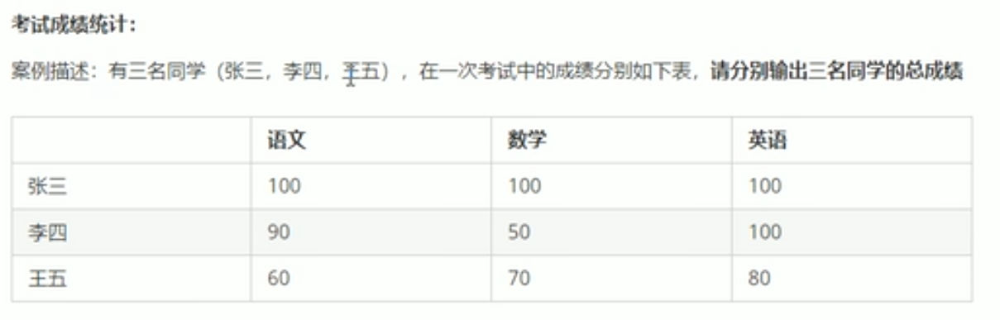

# 数组
## 概述
- 所谓数组，就是一个集合，里面存放了相同类型的数据元素
## 特点
- 数组中每个元素都是相同的数据类型
- 数组是由连续的内存位置组成的
## 一维数组
### 一维数组定义方式
1. `数据类型 数组名[数组长度];`
2. `数据类型 数组名[数组长度] = {a, b, c, ...};`
3. `数据类型 数组名[] = {a, b, c, ...};`
- 示例
```cpp
#include <iostream>
using namespace std;

int main()
{
    // Array
    int arr[5] = {10, 20, 30, 40, 50};
    arr[0] = 1;
    arr[1] = 2;
    arr[2] = 3;
    arr[3] = 4;
    arr[4] = 5;

    for (int i = 0; i < 5; i++)
    {
        cout << arr[i] << endl;
    }

    return 0;
}
```


> [!INFO] INFO
> 定义数组时必须给出数组的初始长度
### 一维数组名
- 用途：
	1. 可以统计数组 在内存中的长度
	2. 可以获取数组在内存中的首地址
- 示例
```cpp
#include <iostream>
using namespace std;

int main()
{
    // Array
    int arr[5] = {10, 20, 30, 40, 50};

    cout << "数组大小为：" << sizeof(arr) << endl;
    cout << "数组元素大小为:" << sizeof(arr[0]) << endl;
    cout << "数组元素个数为:" << sizeof(arr) / sizeof(arr[0]) << endl;

    cout << "数组的内存首地址为:" << arr << endl;
    cout << "数组首元素地址为:" << &arr[0] << endl;//&为取址符号
    cout << "数组首元素地址为:" << &arr[1] << endl;

    return 0;
}
```

> [!INFO] INFO
>数组名是常量，已经指向一段内存空间，不可以再进行赋值操作。

#### 案例1：输出数组最大值
```cpp
#include <iostream>
using namespace std;

int main()
{
    // 五只小猪称体重
    int arr[5] = {300, 350, 200, 400, 250};
    int max = 0;
    int index = 0;
    for (int i = 0; i < 5; i++)
    {
        if (arr[i] > max)
        {
            max = arr[i];
            index = i;
        }
    }
    cout << "最重的小猪是" << index + 1 << "号小猪，有" << max << "斤" << endl;

    return max;
}
```
#### 案例2：数组元素逆置
- [Open: Pasted image 20231231184221.png](attachments/d978873f38f5749b7fc939abe8a531ca_MD5.jpeg)

```cpp
#include <iostream>
using namespace std;

int main()
{
    // 数组元素逆置
    int arr[5] = {1, 2, 3, 4, 5};

    int start = 0;                              // 起始位置索引
    int end = sizeof(arr) / sizeof(arr[0]) - 1; // 末尾元素索引

    while (start < end)
    {
        int temp = arr[start]; // 临时变量接管数组首元素
        arr[start] = arr[end]; // 数组首元素替换为数组末元素
        arr[end] = temp;       // 数组末元素替换为数组首元素

        start++; // 起始位置索引加一，来到后一位。
        end--;   // 末尾位置索引减一，来到前一位。
    }
    // 打印逆置后的数组
    for (int i = 0; i < 5; i++)
    {
        cout << arr[i];
    }

    return 0;
}
```
#### 案例3：冒泡排序
- 作用：最常用的排序算法，对数组内元素进行排序
	1. 比较相邻的两个元素，如果第一个比第二个大，就交换他们两个。
	2. 对每一对相邻的元素做相同的处理，执行完毕后找到一个最大值。
	3. 重复以上步骤，每次比较次数减一，知道不需要比较。
	
[Open: Pasted image 20231231194406.png](attachments/6f9802094563db658f0b6b00393bef37_MD5.jpeg)

```cpp
#include <iostream>
using namespace std;

int main()
{
    // 冒泡排序实现数组升序排列
    int arr[9] = {4, 2, 8, 0, 5, 7, 1, 3, 9};

    for (int i = 0; i < 9 - 1; i++) // 总共排序轮数为：元素个数减一
    {
        for (int j = 0; j < 9 - i - 1; j++) // 每轮对比次数为：元素个数 - 排序轮数 - 1
        {
            if (arr[j] > arr[j + 1]) // 如果数组前一项大于后一项
            {
                // 互换位置
                int temp = arr[j];   // 临时变量接收数组前一项元素
                arr[j] = arr[j + 1]; // 数组前一项元素替换为后一项元素
                arr[j + 1] = temp;   // 数组后一项元素替换为前一项元素
            }
        }
    }
    // 输出数组
    for (int i = 0; i < 9; i++)
    {
        cout << arr[i];
    }

    return 0;
}
```
## 二维数组
- 二维数组在一维数组的基础上，增加了一个维度。
- [Open: Pasted image 20231231194540.png](attachments/d55d77ffc2e1bc48db18656cdbc47aa1_MD5.jpeg)

### 定义方式
1. `数据类型 数组名[行数][列数];`
2. `数据类型 数组名[行数][列数] = {{1, 2, 3...}, {a, b, c...}};`
3. `数据类型 数组名[行数][列数] = {1, 2, 3, 4, 5, 6...};`
4. `数据类型 数组名[][列数] = {1, 2, 3, 4, 5, 6...};`

> 建议使用第二种方法

- 示例
```cpp
#include <iostream>
using namespace std;

int main()
{
    // 二维数组
    int arr[2][3] =
        {
            {1, 2, 3},
            {4, 5, 6}};

    arr[0][0] = 0;

    for (int i = 0; i < 2; i++)
    {
        for (int j = 0; j < 3; j++)
        {
            cout << arr[i][j] << " ";
        }
        cout << endl;
    }

    return 0;
}
```
### 二维数组名称
- 查看二维数组所占的内存空间
- 获取二维数组首地址
```cpp
#include <iostream>
using namespace std;

int main()
{
    // 二维数组
    int arr[2][3] = {
        {1, 2, 3},
        {4, 5, 6}};

    cout << "二维数组占用内存空间为：" << sizeof(arr) << endl;
    cout << "第一行占用内存空间为：" << sizeof(arr[0]) << endl;
    cout << "第一个元素占用内存空间为：" << sizeof(arr[0][0]) << endl;

    cout << "二维数组行数为" << sizeof(arr) / sizeof(arr[0]) << endl;       // 二维数组占用的内存空间除以第一行占用的内存空间得到行数
    cout << "二维数组列数为" << sizeof(arr[0]) / sizeof(arr[0][0]) << endl; // 利用第一行占用的内存空间除以第一个元素占用的内存空间得到列数

    cout << "内存首地址为：" << arr << endl;
    cout << "第一行首地址为：" << arr[0] << endl;
    cout << "第一个元素首地址为：" << &arr[0][0] << endl; // 获取元素首地址需要用发哦取址符&

    return 0;
}
```
- 案例：统计考试成绩
[Open: Pasted image 20231231204440.png](attachments/42ef556ce52902fdd67966d86d553194_MD5.jpeg)

```cpp
#include <iostream>

#include <string>

using namespace std;

  

int main()

{

    // 统计成绩

    int scores[3][3] = {

        {100, 100, 100},

        {90, 50, 100},

        {60, 70, 80}};

    string names[3] = {"张三", "李四", "王五"};

    for (int i = 0; i < 3; i++)

    {

        int sum = 0;

        for (int j = 0; j < 3; j++)

        {

            sum += scores[i][j];

        }

        cout << names[i] << "的个人的总分为: " << sum << endl;

    }

}
```